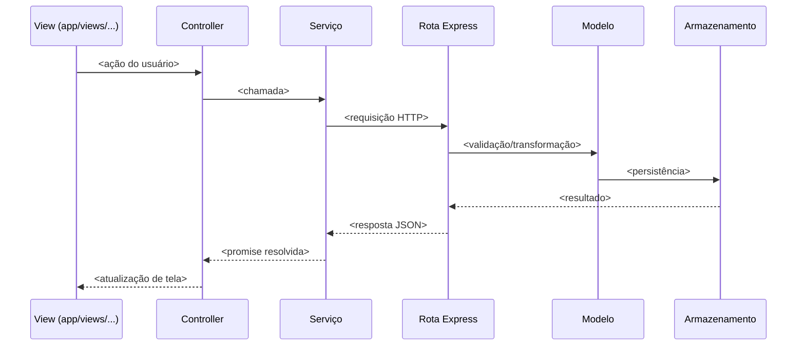

# FLX-<xxx> — <nome do fluxo, ex.: "Fazer pedido">

**Escopo**: <uma frase descrevendo a jornada de usuário coberta>
**Premissas lidas antes do rastreio**: <specs/contratos/constituição consultados>

## Diagrama de sequência

## Narrativa por etapa

1. **View → Controller** (`<arquivo>:<linha>`): <o que dispara e o que é passado>
2. **Controller → Serviço** (`<arquivo>:<linha>`): <o que é chamado>
3. **Serviço → Rota Express** (`<arquivo>:<linha>`): <endpoint, verbo, payload>
4. **Rota → Modelo** (`<arquivo>:<linha>`): <validação/transformação aplicada>
5. **Modelo → Armazenamento** (`<arquivo>:<linha>`): <o que é persistido/lido>
6. **Resposta e atualização de tela** (`<arquivo>:<linha>`): <o que o usuário vê no fim>

## Regras de negócio encontradas neste fluxo

- REG-xxx — <resumo de uma linha> (ver catálogo completo em `regras-de-negocio.md`)

## Divergências encontradas neste fluxo

- DIV-xxx — <resumo de uma linha> (ver `divergencias.md`)
